# Lunarbit

## Evidence-verifiable personal-commerce GraphRAG

Lunarbit reconstructs a private, multi-year history of Zomato and Swiggy food-delivery and grocery activity into a provenance-first data system. It is designed to answer questions about orders, merchants, fees, discounts, taxes, payments, delivery evidence, and spending patterns while preserving the chain from every answer back to source evidence.

This is not a PDF chatbot, a generic expense dashboard, or an unverified text-to-Cypher demo. Lunarbit is a portfolio-grade engineering project focused on the difficult parts of real-world AI systems: messy documents, layout-aware extraction, evidence alignment, deterministic financial logic, privacy boundaries, agentic enrichment, graph modeling, retrieval, evaluation, and public explainability.

> **Project thesis:** trustworthy GraphRAG is not just retrieval plus an LLM. It is a system that separates source claims, normalized facts, deterministic calculations, identity decisions, unresolved uncertainty, and analytical findings—and makes each layer auditable.

[](https://www.python.org/)
[](tests/)
[](https://mypy.readthedocs.io/)
[](https://docs.astral.sh/ruff/)
[](#privacy-and-data-boundaries)

## Why this project is interesting

Most personal-finance prototypes flatten documents into rows and ask a model to summarize them. That approach loses layout, source precision, document scope, contradictions, and the distinction between an invoice assertion and a confirmed payment.

Lunarbit treats the archive as an evidence reconstruction problem:

- one order may be distributed across an email, an order summary, a merchant invoice, a platform-fee invoice, and a delivery invoice;
- an email without a PDF is still a complete order-evidence unit rather than a discarded message;
- tables, page coordinates, reading order, source spans, and document roles are preserved;
- money is represented with source precision and reconciled deterministically, never by an LLM or floating-point arithmetic;
- model output is candidate enrichment only and cannot write canonical identities, financial truth, or graph state directly;
- public output is a reviewed projection with aliases and redacted evidence, never a view over the raw private archive.

## Recruiter snapshot

| Area | Demonstrated engineering signal |
| --- | --- |
| Document intelligence | Native PDF extraction, layout and table preservation, page coordinates, quality profiles, email parsing, and document-role classification |
| Data contracts | Strict Pydantic contracts, content-addressed IDs, deterministic manifests, source hashes, provenance spans, and atomic validation boundaries |
| Agentic AI | Cloudflare Workers AI with Gemma 4, streamed tool calls, typed JSON Schema, bounded context, evidence-constrained candidates, and safe failure diagnostics |
| Financial correctness | Exact source amounts, scoped money components, deterministic reconciliation, residual visibility, and no model arithmetic |
| Graph readiness | Order bundles, merchant/legal-entity/delivery evidence, temporal metadata, candidate relationships, query families, and reversible resolution decisions |
| Production judgment | Sequential calls, hard token budgets, no private data in Git, `0600` private artifacts, TDD commits, and explicit quality gates before scaling |

### Current verified corpus and quality metrics

These are measurements from the local private corpus and deterministic pipeline. The source archive and generated private artifacts are intentionally excluded from GitHub.

- 456 relevant source emails and 763 PDFs across 857 PDF pages;
- 454 current reconstructed order records under the documented counting policy;
- 24,675 deterministic evidence chunks across 456 order-evidence bundles;
- 423 planned Gemma enrichment calls with sequential concurrency of one;
- 79,351 maximum estimated input tokens in the current plan, below the 80,000 hard input limit;
- 24,000 completion tokens reserved per call inside Gemma 4's 256,000-token context window;
- zero input chunks skipped or quarantined in the latest dry run;
- 47 automated tests passing, plus Ruff lint/format and strict mypy checks.

The agentic stage is intentionally gated. A structurally valid response is not considered high quality unless it covers every source chunk and every deterministic money component with source-linked interpretations. Corpus-scale inference will begin only after the bounded financial pilot passes that gate.

## Architecture

```mermaid
flowchart LR
    A[Private PDFs and mailboxes] --> B[Deterministic ingestion]
    B --> C[Document and message contracts]
    C --> D[Layout-aware extraction]
    D --> E[Order evidence bundles]
    E --> F[Deterministic rich chunks]
    F --> G[Bounded Gemma enrichment]
    G --> H[Typed validation and quarantine]
    H --> I[Entity and order resolution]
    I --> J[Financial reconciliation]
    J --> K[Neo4j temporal graph]
    K --> L[Exact, lexical, dense, and graph retrieval]
    L --> M[Evidence-grounded answer workflow]
    M --> N[Privacy-reviewed public projection]
```



The implemented foundation currently covers ingestion, extraction, chunk contracts, order-evidence bundling, and the guarded agentic enrichment boundary. Neo4j loading, hybrid retrieval, public projection, and the live application are planned stages with explicit acceptance criteria in [`PLAN.md`](PLAN.md).

## What the system preserves

Each deterministic chunk can carry:

- raw and normalized private text;
- semantic summary and embedding text;
- page number, bounding box, reading order, table ID, row index, and parent region;
- source document or message identity and source hash;
- candidate facts with exact source spans;
- deterministic entity mentions and money components;
- graph candidates and query-family metadata;
- extraction method, confidence, completeness, validation, and privacy state.

This metadata is not decorative. It enables reproducibility, source replay, deterministic validation, retrieval routing, and later graph invariants.

## Agentic enrichment: bounded, typed, and evidence-first

Lunarbit uses `@cf/google/gemma-4-26b-a4b-it` through Cloudflare's streamed REST interface for candidate semantic enrichment. The model receives relevant order bundles rather than the entire corpus or one isolated request per chunk.

The current contract provides:

- the pinned official Gemma tokenizer for input accounting;
- a 64k target and 80k hard input ceiling;
- 24k reserved completion tokens;
- sequential execution with concurrency `1`;
- a 600-second socket and wall-clock deadline;
- one required `submit_agentic_regions` tool call;
- an exact ordered source-chunk coverage manifest;
- an exact ordered money-component coverage manifest;
- batch-scoped bundle and chunk identifiers;
- source-backed entity and money reference constraints;
- bounded region counts, narrative lengths, and candidate arrays;
- atomic quarantine for incomplete, truncated, cross-bundle, unsupported, or malformed proposals;
- privacy-safe diagnostics that retain error categories and numeric provider codes, never private model messages.

The model may propose semantic regions, retrieval text, facts, entities, money interpretations, relationships, conflicts, and uncertainty. It may not create canonical IDs, perform authoritative arithmetic, resolve identities, or write graph state.

## Privacy and data boundaries

The repository is public-facing, but the source archive is private. The privacy boundary is treated as an engineering invariant:

- raw PDFs, mailboxes, processed private JSON, and model outputs are ignored by Git;
- `.env` and credentials are never committed;
- private result files are written atomically with restrictive permissions;
- public identifiers are deterministic aliases, not platform order IDs or invoice numbers;
- customer, proprietor, delivery-person, address, tax-registration, and payment details are not exposed in the public projection;
- public evidence is manually redacted or synthetic and is served separately from the private graph;
- canonical graph writes require deterministic validation and privacy review.

The private corpus is not included in this repository. Do not run the pipeline against data you do not have permission to process.

## Engineering workflow

The project follows visible test-driven development. Contract tests are written for failure modes such as incomplete coverage, unsupported entities, invalid spans, mixed tool content, truncation, provider errors, and privacy leakage before the implementation is accepted.

Run the local checks:

```bash
.venv/bin/pytest -q
.venv/bin/ruff check src scripts tests
.venv/bin/ruff format --check src scripts tests
.venv/bin/mypy src scripts
```

Build the deterministic private pipeline:

```bash
.venv/bin/python scripts/build_json.py --input data --output data/processed
.venv/bin/python scripts/build_chunks.py --input data/processed
```

Inspect the agentic plan without sending private data to a model:

```bash
.venv/bin/python scripts/run_agentic_chunking.py --input data/processed
```

Live inference is deliberately capped and sequential:

```bash
.venv/bin/python scripts/run_agentic_chunking.py \
  --input data/processed \
  --execute \
  --max-calls 1
```

Set `CLOUDFLARE_ACCOUNT_ID` and `CLOUDFLARE_AUTH_TOKEN` through the ignored `.env` file before live execution. Start with a bounded pilot and inspect quarantine reasons before increasing the call cap.

## Repository map

```text
src/lunarbit/
├── models.py       # strict source, chunk, candidate, and validation contracts
├── extract.py      # deterministic email/document ingestion primitives
├── pdf.py          # native PDF/layout extraction and quality handling
├── chunk.py        # deterministic layout-aware rich chunk construction
└── agentic.py      # Gemma batching, SSE transport, typed tool output, validation

scripts/
├── build_json.py               # private deterministic archive construction
├── build_chunks.py             # private chunk archive construction
└── run_agentic_chunking.py     # dry-run planning and capped live enrichment

tests/
├── test_extract.py
├── test_pdf_processing.py
├── test_chunk.py
├── test_agentic.py
└── test_privacy.py

PLAN.md       # complete architecture, ontology, acceptance criteria, and roadmap
MEMORY.md     # append-only engineering handoff and decisions
cypher/       # graph design assets and future migrations
web/          # public application surface under construction
```

## Roadmap to the public demo

### Phase 1 — deterministic evidence foundation

Completed foundation: source ingestion, PDF and email extraction, layout-aware chunks, order-evidence bundles, strict contracts, privacy controls, and reproducible validation.

### Phase 2 — rich agentic chunking

Current stage: complete the bounded financial pilot, validate golden entity and money cases, then run controlled enrichment over the corpus. Candidate output remains source-linked and quarantinable.

### Phase 3 — order and entity resolution

Resolve document bundles, merchants, legal entities, delivery evidence, item hierarchies, aliases, and uncertainty through reversible deterministic decisions.

### Phase 4 — financial and economic core

Compile exact money components, reconcile invoice scopes, expose unexplained residuals, and derive governed economic metrics without model arithmetic.

### Phase 5 — Neo4j graph

Load an idempotent temporal graph with constraints, exact indexes, full-text indexes, vector indexes, and invariant checks.

### Phase 6 — Hybrid GraphRAG

Route questions across exact lookup, lexical retrieval, dense retrieval, graph expansion, reranking, and answer verification. Every showcased answer must expose its graph path and evidence.

### Phase 7–8 — economic intelligence and public product

Add price and fee indices, membership ROI, spending decomposition, a privacy-reviewed public projection, an evidence laboratory, benchmark pages, and the recruiter-facing live demo.

## Resume-ready positioning

The final resume entry should use measured results rather than adjectives:

> Built Lunarbit, a privacy-safe, evidence-verifiable personal-commerce GraphRAG system that reconstructed **454 orders** from **500+ private Zomato and Swiggy documents**, preserving layout, source spans, deterministic financial components, and temporal provenance; implemented strict Pydantic contracts, bounded Gemma tool-calling enrichment, and TDD validation for privacy-safe graph construction.

The final version will add measured reconciliation accuracy, entity-resolution F1, retrieval Hit@1, latency, and public-demo reliability only after those benchmarks are implemented and published.

## Project status

Lunarbit is an active portfolio build. The deterministic evidence foundation and guarded agentic contract are implemented. The full public claim remains intentionally gated on the financial quality pilot, deterministic resolution, graph construction, retrieval benchmarks, privacy-reviewed projection, and deployment.

That distinction is part of the project: a trustworthy AI engineer should know exactly which results are measured, which are private, which are candidates, and which are still hypotheses.

## License and responsible use

The source archive belongs to the data owner and is not distributed with this repository. Before processing any archive, verify consent, access rights, retention requirements, and privacy obligations. Public examples should use synthetic or manually redacted evidence.
