# Lunarbit

## Evidence-Verifiable Personal Commerce GraphRAG

> **Reconstructing six years of food commerce into an auditable personal economic-intelligence graph.**

[](https://www.python.org/)
[](tests/)
[](https://mypy.readthedocs.io/)
[](https://docs.astral.sh/ruff/)
[](#privacy-by-design)

Lunarbit turns a private archive of Zomato and Swiggy food-delivery and grocery records—emails, order summaries, merchant invoices, fee invoices, delivery evidence, and history exports—into a provenance-first temporal Neo4j knowledge graph and finance-first intelligence engine.

It is a product-minded GraphRAG system for difficult questions about orders, prices, merchants, fees, discounts, taxes, payments, delivery evidence, and spending change. Every answer is designed to distinguish what a source asserted, what deterministic code normalized, what was calculated, what remains uncertain, and which evidence supports the claim.

### The thesis

> **Trustworthy GraphRAG is not retrieval plus an LLM.** It is source evidence, typed contracts, reversible identity resolution, deterministic financial truth, bounded retrieval, and citation-level verification presented as one inspectable system.

Lunarbit is deliberately more than a PDF chatbot, a generic expense dashboard, or an unverified text-to-Cypher demo. Models propose semantic structure; deterministic code decides money, graph truth, privacy, and whether an answer is supportable.

## What the product can answer

The graph is built for questions that require cross-document and temporal reasoning:

- What did the same restaurant’s comparable biryani cost three years ago, and which evidence supports the change?
- Did discounts and membership benefits offset delivery, platform, handling, and tax charges?
- How did spending change month-over-month, and was the change caused by frequency, basket size, fees, or price?
- How many times does a delivery-partner mention appear, without silently asserting person identity?
- Which invoice, page region, and financial component support a payment or reconciliation claim?
- Which merchants, items, fees, or templates show anomalies, change points, substitution, or price-elasticity signals?

The runtime uses governed templates, exact identifiers, Lucene/BM25, dense retrieval, RRF, bounded graph expansion, Cohere reranking, Decimal arithmetic, and explicit abstention when evidence is incomplete or conflicting.

## Evidence to graph to answer

```mermaid
flowchart LR
    A["Private evidence"] --> B["Deterministic extraction"]
    B --> C["Evidence bundles"]
    C --> D["Rich chunks"]
    D --> E["Bounded enrichment"]
    E --> F["Validation and quarantine"]
    F --> G["Resolution and finance"]
    G --> H["Temporal events"]
    H --> I["Neo4j graph"]
    I --> J["Exact BM25 HNSW graph retrieval"]
    J --> K["RRF reranking verification"]
    K --> L["FastAPI answer contract"]
    L --> M["Privacy-safe public projection"]
```



If a Markdown host does not render Mermaid, this equivalent text map remains readable:

```text
private evidence
  -> deterministic extraction
  -> order bundles and rich chunks
  -> bounded agentic enrichment
  -> typed validation / quarantine
  -> reversible resolution + deterministic finance
  -> temporal financial events
  -> Neo4j graph
  -> exact + BM25 + HNSW + graph retrieval
  -> RRF + reranking + verification
  -> FastAPI answer contract
  -> privacy-safe public projection
```

### The graph model

The graph keeps truth scopes separate instead of flattening every document into a row:

| Layer | Examples | Why it matters |
| --- | --- | --- |
| Evidence | documents, pages, messages, chunks, source spans | Replays the original claim and its location |
| Commerce | orders, order lines, merchants, outlets, platforms | Reconstructs one order across multiple records |
| Product | observed items, merchant-scoped items, comparable groups | Prevents unsafe cross-merchant identity merges |
| Identity | aliases, legal entities, delivery mentions, decisions | Keeps resolution reversible and privacy-aware |
| Financial | item amounts, fees, taxes, discounts, payments, refunds | Preserves scope, Decimal precision, and residuals |
| Intelligence | events, metrics, findings, hypotheses, query traces | Supports temporal economics and evidence-backed analysis |

Edges encode typed provenance and business relationships such as `EVIDENCED_BY`, `PART_OF_ORDER`, `ORDERED_FROM`, `CONTAINS_ITEM`, `HAS_MONEY_COMPONENT`, `RECONCILES_WITH`, `MENTIONS`, `PRECEDES`, and `SUPPORTS`. A vector hit can find a candidate; the graph explains why it belongs to an order, a period, a merchant, and a financial claim.

## Agentic chunking, with deterministic control

Lunarbit does not issue one model call per chunk and does not dump the whole corpus into one context. Template-compatible order bundles are packed into medium-sized, rate-governed calls. The model proposes semantic regions, summaries, query families, facts, entities, money interpretations, relationships, conflicts, and uncertainty. Deterministic validators then enforce:

- exact ordered source-chunk and money-component coverage;
- source spans, bundle isolation, and closed references;
- bounded region, narrative, and candidate-array sizes;
- persistent IDs generated by code, never by the model;
- accepted, quarantined, repaired, retried, and canonical archives;
- privacy-safe diagnostics and atomic checkpoints.

The final corpus is multi-resolution rather than one flat chunk stream:

1. **Evidence cells** — source-local claims and coordinates.
2. **Financial events** — one source-backed temporal event per money component.
3. **Transaction bundles** — an order-level view across documents and email-only evidence.
4. **Entity histories** — merchant, outlet, item, and platform histories.
5. **Temporal research chunks** — annual and period windows for economic analysis.

## Retrieval engineered as a system

| Capability | Lunarbit implementation |
| --- | --- |
| Exact retrieval | Governed, parameterized, read-only Neo4j queries |
| Lexical retrieval | Neo4j Lucene full-text and application-owned BM25 paths |
| Dense retrieval | Cohere Embed v4 reference vectors with Neo4j HNSW |
| MRL | 256/512/1024 normalized Matryoshka-prefix indexes derived from the 1,536-d reference |
| HNSW | Cosine search with `M=16`, construction effort `100`, scalar-quantized candidate indexes |
| RaBitQ | A portable Milvus/Zilliz adapter boundary; compression never replaces canonical graph truth |
| Fusion | Reciprocal Rank Fusion (RRF), metadata filters, graph expansion, and source authority |
| Reranking | Cohere Rerank v4 after bounded candidate generation |
| Verification | Citation support, coverage, provenance, conflict, and abstention gates |

The serving reference is Cohere Embed v4 at 1,536 dimensions. The retained 1,024-dimensional Mistral embedding is an explicit ablation baseline. Index parameters, recall, grounding, latency, and storage are benchmarked rather than assumed.

## Verified private corpus snapshot

These measurements come from the local private corpus. The source archive and generated private artifacts are excluded from GitHub.

| Measure | Current result |
| --- | ---: |
| Relevant source emails | 456 |
| PDFs / PDF pages | 763 / 857 |
| Reconstructed orders | 454 |
| Deterministic evidence chunks | 24,675 |
| Final agentic regions | 13,597 |
| Source-backed money components | 5,199 |
| Multi-resolution financial chunks | 11,368 |
| Canonical graph | 53,983 nodes / 85,607 relationships |
| Cohere reference vectors | 24,675 at 1,536 dimensions |
| Canonical-oracle answer cases | 24 / 24 measured correctness gates |

The graph rebuild is closed-reference and idempotent. Financial amounts use Decimal semantics. Large aggregates page to completion under action budgets; partial results are never presented as lifetime totals. The corpus is private by construction.

## Finance-first intelligence engine

Finance is not a report added after retrieval; it is a first-class graph and evaluation boundary. The financial layer is a deterministic economic engine, not model-generated arithmetic. Each amount retains its source scope, precision, lineage, and reconciliation state:

- multi-document reconciliation with explicit truth scopes and residuals;
- separate customer-payable, merchant-invoice, platform-assertion, and settlement-unknown views;
- a temporal financial-event graph with immutable component lineage;
- personal food price indices and comparable-basket history;
- spending-change decomposition by frequency, basket, price, fee, discount, and membership effects;
- fee, discount, promotion, tax, refund, and membership economics;
- descriptive price-elasticity and substitution signals;
- robust anomaly and change-point detection;
- bounded counterfactual simulations;
- a governed hypothesis → experiment → evidence → finding loop.

Governed metrics include `effective_order_cost`, `fee_burden_ratio`, `discount_capture_rate`, `delivery_burden_ratio`, `membership_net_benefit`, `unexplained_discount_share`, and personal food/grocery price indices. Every observation carries its period, formula version, evidence coverage, comparability level, and confidence.

This makes questions such as “why did spending rise?” executable rather than rhetorical: the system decomposes the change into frequency, basket, price, merchant mix, item mix, fees, taxes, discounts, and residuals, then links each contribution back to evidence. Counterfactuals expose assumptions and unsupported elements instead of presenting causal guesses as facts.

## Public product surface

**Nexus Insight** is the browser-facing intelligence workspace. It calls a dedicated public FastAPI process, never Neo4j directly and never the private answer runtime.

- aggregate topology exposes graph classes, relationship types, and counts—not canonical IDs or source fields;
- reviewed showcase scenarios return deterministic calculations, public graph paths, and synthetic evidence cards;
- unreviewed or unsupported requests abstain visibly;
- private embeddings, source text, personal identifiers, credentials, and raw invoices stay server-side;
- the visual system supports isolated synthetic commerce profiles and independent visual profiles without crossing data boundaries.

The authenticated private API provides typed retrieval and evidence-grounded answers through `/v1/private/retrieval` and `/v1/private/answer`. Public planning and reviewed demonstrations are available through `/v1/query/plan` and `/v1/public/showcase-answer`.

## Privacy by design

The public repository is intentionally not a copy of the personal archive:

- raw PDFs, mailboxes, processed private JSONL, provider responses, and generated private graph artifacts are gitignored;
- `.env` files and API credentials never enter commits;
- private outputs are written atomically with restrictive permissions;
- public identifiers are deterministic aliases, while names, addresses, payment references, registrations, and exact platform IDs remain private;
- public evidence is synthetic or manually redacted and served through a separate projection;
- the browser never connects directly to Neo4j or a provider API.

## Production boundaries

- deterministic ingestion supports both PDF-backed and mail-only orders;
- strict Pydantic contracts, content-addressed IDs, source hashes, and atomic archives protect provenance;
- input guardrails reject prompt/secret extraction, control-character obfuscation, arbitrary Cypher/SQL/tool commands, and explicit off-scope model use without blocking ordinary food questions;
- bearer-protected private routes, rate limiting, security headers, non-wildcard CORS, and public/private process separation are enforced at the API boundary;
- public identifiers are aliases, not platform order IDs or invoice numbers;
- no private PDFs, mailboxes, processed JSON, provider responses, API keys, or `.env` files are committed.

## Verification loop

Lunarbit follows test-first development as an engineering control, not as a badge. Every material capability moves through the same loop:

1. **Specify the failure** — write a contract or invariant test for the behavior, privacy boundary, or financial edge case.
2. **Make it fail** — keep the red test visible so the intended gap is reviewable.
3. **Implement the smallest safe path** — preserve immutable inputs, typed contracts, and deterministic ownership boundaries.
4. **Replay the corpus invariants** — run focused tests, the full suite, strict MyPy, Ruff, privacy/hygiene checks, and relevant frontend builds.
5. **Record the proof** — commit the red/green progression with a precise engineering message and update the handoff only with measured facts.

The test surface covers extraction coordinates, mail-only orders, chunk and money coverage, source provenance, reversible resolution, Decimal reconciliation, graph idempotence, retrieval fusion, citation support, abstention, API authorization, input guardrails, public privacy projection, and UI profile isolation. A plausible model response is never accepted as a passing test.

## Stack

```text
Python 3.12+ · Pydantic v2 · PyMuPDF/pdfplumber · pytest/Hypothesis
Neo4j 5.26 · Neo4j HNSW · Lucene/BM25 · Cohere Embed v4/Rerank v4
FastAPI · Neo4j Python driver · deterministic RRF · Decimal finance
React 19 · TanStack Start · TypeScript · Nexus Insight · Vite
```

The architecture is LangGraph-ready for explicit offline and online workflow orchestration, while canonical writes and financial truth remain application-owned and deterministic. The deployment target is a server-side FastAPI service with Neo4j AuraDB and a privacy-reviewed public projection.

## Run the local checks

```bash
uv run pytest -q
uv run ruff check src scripts tests
uv run ruff format --check src scripts tests
uv run mypy --strict src
uv run python scripts/verify_repository_hygiene.py
```

Build the deterministic private stages:

```bash
uv run python scripts/build_json.py --input data --output data/processed
uv run python scripts/build_chunks.py --input data/processed
```

The graph, economic-intelligence, embedding, and evaluation builders consume versioned private archives; use each script’s `--help` contract for the required roots before running them.

Run the public API and active Nexus Insight workspace:

```bash
uv run python scripts/serve_public_api.py

cd "visualization/Nexus Insight"
npm install
npm run dev
```

Provider-backed work is always opt-in. Put credentials only in the ignored `.env`, start with a bounded smoke run, and inspect deterministic validation output before scaling. See [`PLAN.md`](PLAN.md) for the complete ontology, acceptance criteria, retrieval policy, and deployment gates.

## Repository map

```text
src/lunarbit/                 contracts, extraction, graph, finance, retrieval, API
scripts/                      deterministic builds, embeddings, indexes, evaluation, servers
tests/                        extraction, finance, graph, retrieval, privacy, API, and TDD
visualization/Nexus Insight/  active public React/TanStack workspace
web/                          retained synthetic profile workspace
PLAN.md                       architecture, schema, decisions, and acceptance gates
MEMORY.md                     append-only engineering handoff
```

## Status and definition of done

Implemented locally: deterministic extraction, mail-only order handling, rich agentic chunking, reversible resolution, Decimal financial truth, temporal economic compilation, Neo4j ingestion, HNSW/Lucene/BM25/RRF retrieval, Cohere reranking, citation verification, authenticated FastAPI answers, canonical-oracle evaluation, public projection, and the Nexus Insight boundary.

Remaining release gates: human-reviewed natural-language evaluation, a deployed aggregate Neo4j connection, cloud deployment, and final public privacy review. Keeping these gates visible is part of the design: measured results, private artifacts, reviewed projections, and planned capabilities are never presented as the same thing.

## Responsible use

The source archive belongs to its data owner and is not distributed with this repository. Process only records you are authorized to access, retain, and analyze. Public demonstrations should use synthetic or manually redacted evidence.
